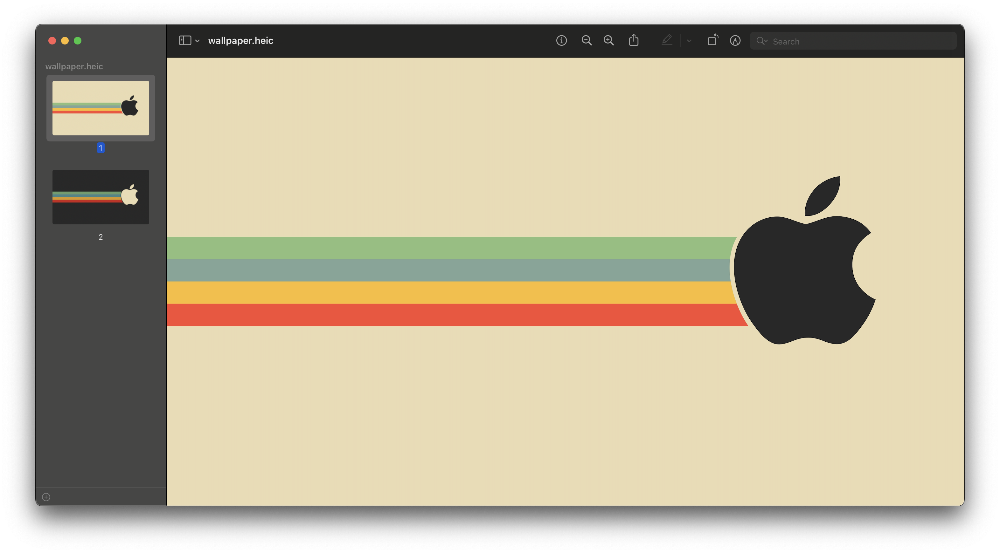

# gruvbox-apple-theme
Gruvbox Apple Dynamic Theme for macOS / Mac.

Thanks [atlas-ark](https://www.reddit.com/user/atlas-ark/) for creating the original static wallpaper and shared it on [Reddit](https://www.reddit.com/r/MacOS/comments/r10e40/i_created_an_app_for_making_dynamic_wallpapers/).

Dynamic wallpaper created using [Equinox](https://github.com/rlxone/Equinox). This dynamic wallpaper toggles light or dark wallpaper based on the system theme setting.

## Preview
Light wallpaper

Dark wallpaper

